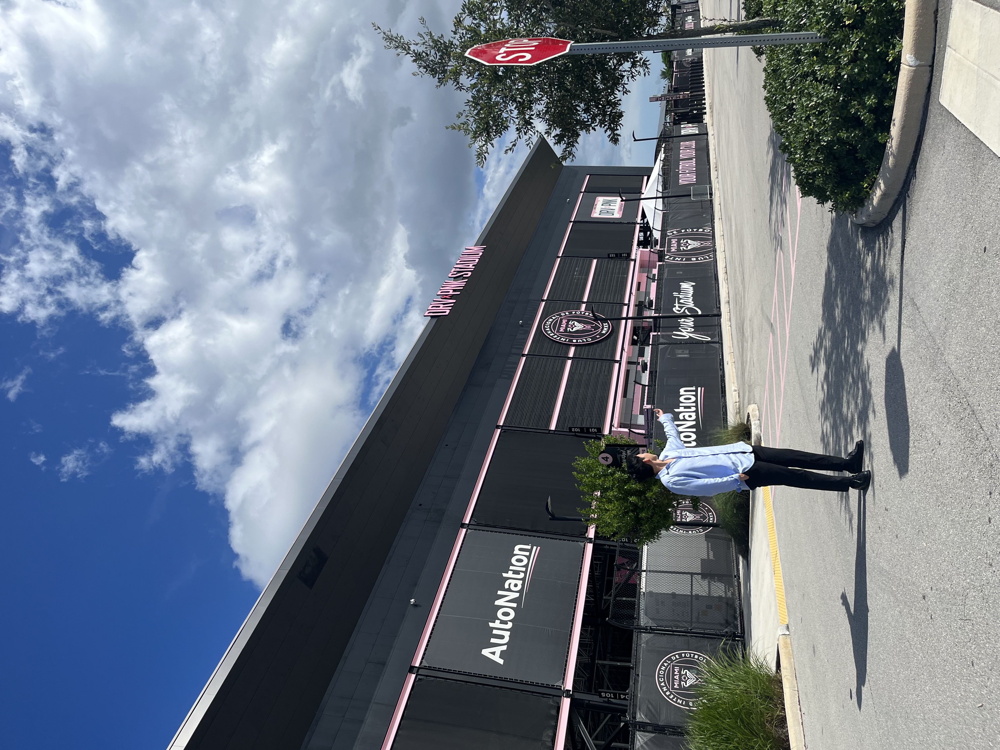

<link rel="stylesheet" href="styles.css" type="text/css">
<link rel="stylesheet" href="site_libs/academicons-1.9.1/css/academicons.min.css"/>

 

 

   
👋🏽 Hi there, my name is Daehwan Kim. 

I am a Project Manager in the Department of Sales & Marketing at MIDAS Information Technology Co., Ltd. 

### 💼 Professional Experience

- 🚀 **Project Manager, MIDAS Information Technology Co., Ltd.**
  - Successfully promoted Midas Structural Engineering Software to 70-80 universities in the US, UK, and Canada, exceeding targets by 200%.
  - Standardized Customer Relationshiop Management (CRM) tool such as HubSpot to enhance customer data utilization, resulting in a 30% increase in free trial registrations for 'Civil' and 'GTS NX' products.
  - Drove a 10% boost in blog views, web visitors, and trial downloads within 3 months through the integration of new CRM tools and data-driven strategies.
  - Enhanced marketing performance, doubling activated customer count for 'Civil' product.

- 🎥 **CEO at Bowlow**
  - Directed video shoots and managed global content releases, achieving substantial audience growth and engagement.
  - Led influencer casting, producing captivating program content, and significantly enhancing social media traffic and audience engagement.

### 🌱 Current Focus

- Continuously honing my skills in project management and exploring innovative marketing strategies to drive business growth and better user engagement.
- 💻 As for my future, I aspire to work as a data scientist and collaborate closely with marketing teams, utilizing data-driven insights to optimize strategies and achieve exceptional results.

### 👤 Hobbies

- 🎾 In my free time, you can find me playing tennis.
- ⚽ I also enjoy analyzing soccer tactics and strategies.

### 🛠️ Skills

- 💪 Specialized in analyzing customer-driven data using Customer Relationship Management tools such as Hubspot and applying insights to drive strategic decision-making, leveraging my experience in project management and communication.

+ Programming: Python, R
+ Data visualization: HubSpot, Power BI
+ Database: SQL

### 📫 Connect with Me

Feel free to connect with me on [LinkedIn](https://www.linkedin.com/in/daehwankim0/)!
