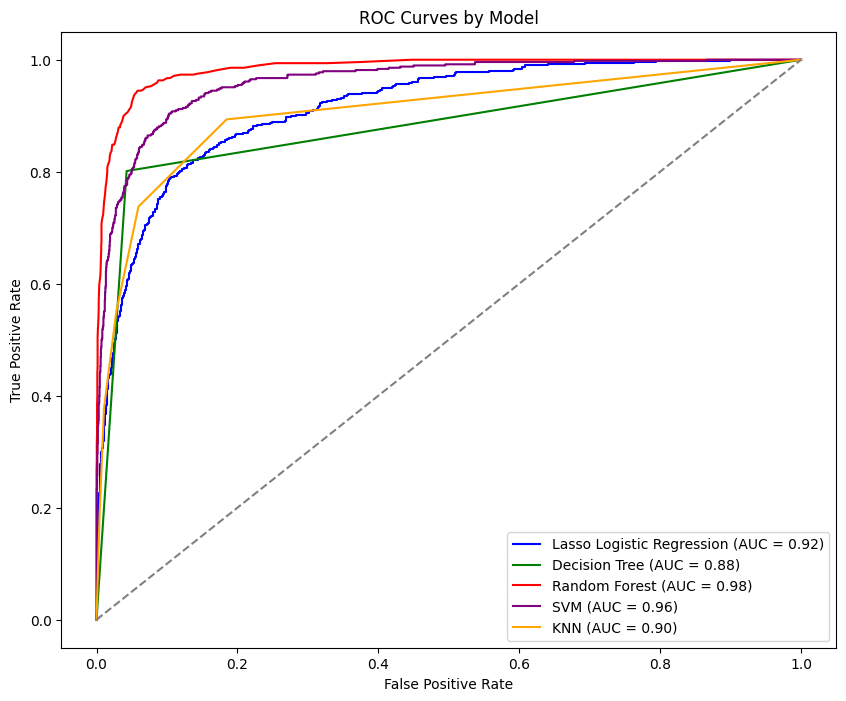

<link rel="stylesheet" href="styles.css" type="text/css">
<link rel="stylesheet" href="site_libs/academicons-1.9.1/css/academicons.min.css"/>

   

## **Predictive Analysis of Bank Customer Churn in Python: Enhancing Retention Strategies through Machine Learning**

 

   

### 1. Figure

[Fig. Random Forest features by importance]

 

  

### 2. Goal
The primary goal of this project was to predict customer churn using various machine learning models. By accurately identifying customers likely to churn, the analysis aimed to provide insights that could inform customer retention strategies and improve decision-making processes in customer relationship management.

 

### 3. Methodology & Summary

  + **Methodology**: The project involved an exploratory data analysis to understand customer demographics, transaction behaviors, and financial habits. This was followed by preprocessing the data, including feature scaling and encoding. Various machine learning models such as Random Forest, SVM, Decision Tree, KNN, and Lasso Logistic Regression were then trained and evaluated.
  
  + **Summary**: The Random Forest model emerged as the top performer with an accuracy of 95.39% and an AUC score of 0.98. Key variables influencing churn, consistent across models, included Total_Trans_Amt, Total_Trans_Ct, and others. The analysis provided valuable insights into factors driving customer churn, highlighting the potential for targeted retention strategies and data-driven decision-making in banking services.

 

### 4. Code

Please click [HERE](https://nbviewer.org/github/daehwankim96/daehwankim96.github.io/blob/main/files/Bank_Churn_Rate.ipynb) for the analysis report and code.

 

