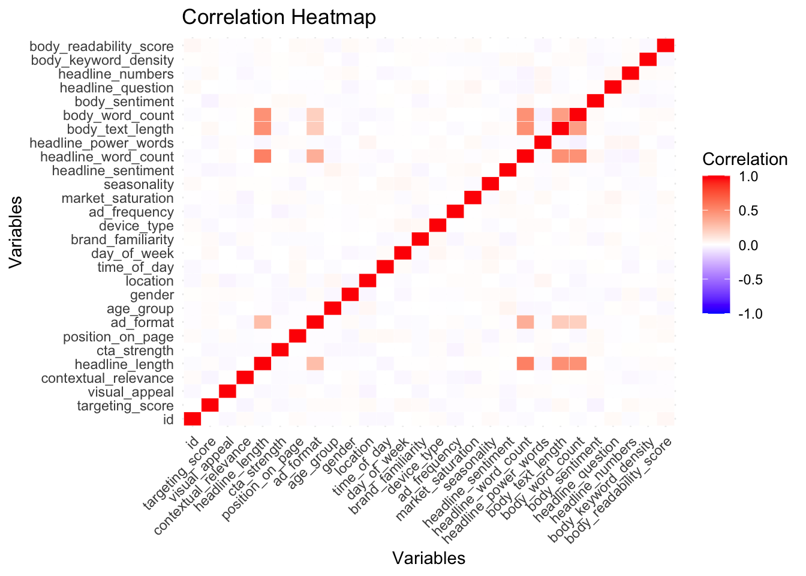
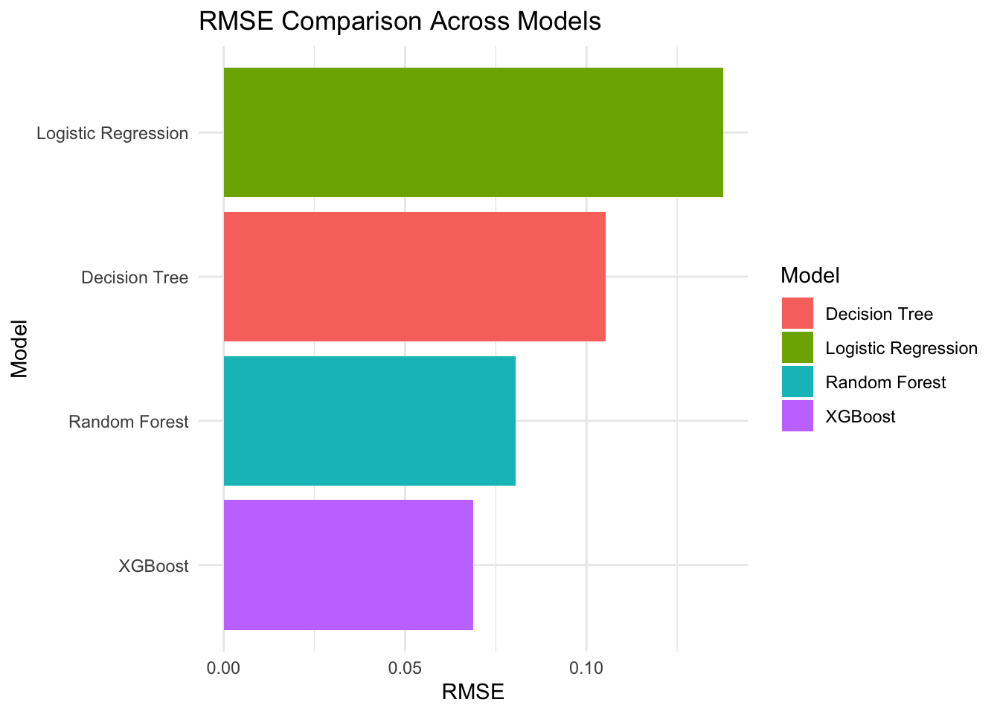

<link rel="stylesheet" href="styles.css" type="text/css">
<link rel="stylesheet" href="site_libs/academicons-1.9.1/css/academicons.min.css"/>

   

## **Predictive Analysis of Click-Through Rate (CTR) in R: Optimizing Digital Ad Performance with Machine Learning**

 

   

### **1. Figure**

[Fig1. Correlation Heatmap of Ad Features for CTR Prediction]

 

[Fig2. RMSE Comparison of Machine Learning Models]

 

  

### **2. Goal**
This project predicts Click-Through Rate (CTR) to optimize digital ad performance. Using machine learning, it identifies key ad factors—quality, relevance, and audience targeting—to provide actionable insights for improving engagement and conversions. By leveraging data-driven strategies, the project helps businesses enhance ad effectiveness and maximize return on investment.

 

### **3. Methodology & Summary**

  + **Methodology**: Data was cleaned and preprocessed, handling missing values and encoding categorical variables. Feature engineering identified key predictors, and machine learning models (Logistic Regression, Decision Tree, Random Forest, XGBoost) were tested. Bayesian Optimization fine-tuned hyperparameters to maximize accuracy. A comparative evaluation of models was conducted using RMSE to ensure robust predictive performance.
  
  + **Summary**: XGBoost outperformed other models, delivering the most accurate CTR predictions by capturing complex ad-performance patterns. The final model provides valuable insights to refine targeting strategies and improve digital advertising efficiency. These insights empower businesses to allocate marketing budgets effectively and drive higher user engagement.

 

### **4. Code**

Please click [HERE](./files/PAC_Dae-Hwan-Kim.html) for the analysis report and code.

 

