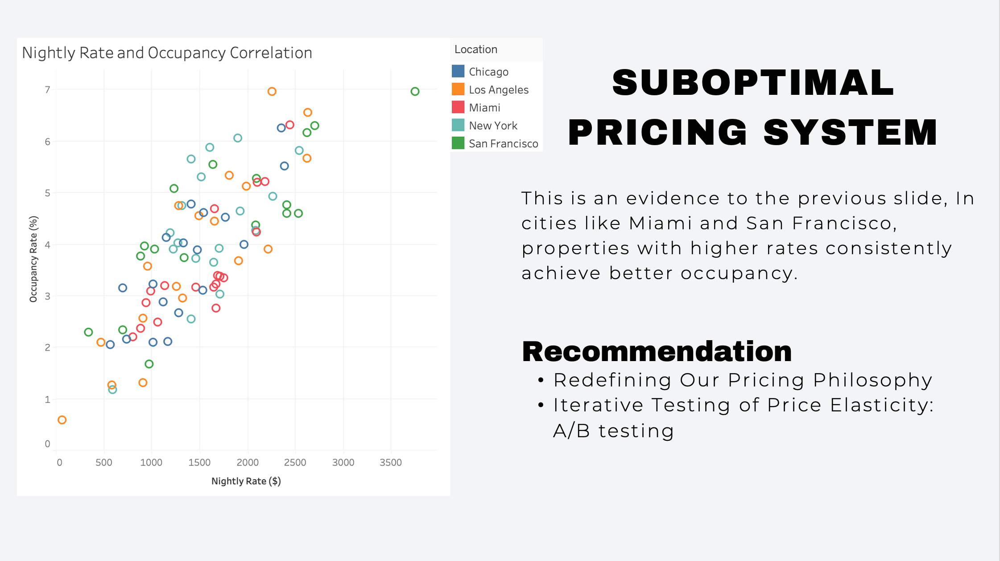
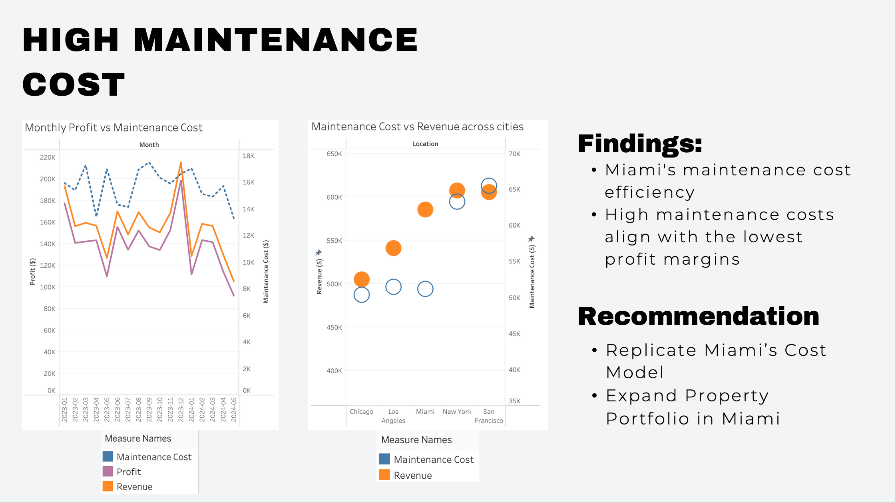

<link rel="stylesheet" href="styles.css" type="text/css">
<link rel="stylesheet" href="site_libs/academicons-1.9.1/css/academicons.min.css"/>

   

## **Enhancing Profitability for Airbnb Properties Using Tableau and Predictive Analytics**

 

   

### **1. Figure**

[Fig1. Nightly Rate and Occupancy Correlation]

 

[Fig2. High Maintenance Cost Analysis]

 

  

### **2. Goal**
This project analyzed Airbnb operational data from RevBoost across five major U.S. cities—Chicago, Los Angeles, New York, Miami, and San Francisco—to address an 18% revenue decline in Q1 2024. The goal was to identify key inefficiencies in cost, pricing, and marketing strategies. By uncovering these gaps, the project aimed to develop data-driven solutions. The objective was to restore profitability and support sustainable growth.

 

### **3. Methodology & Summary**

  + **Methodology**: Tableau was used to visualize regional trends in profitability, spending behavior, and cost breakdowns. Regression analysis and Excel modeling helped identify pricing inefficiencies and cost drivers. ChatGPT simulations provided realistic financial scenarios for evaluating strategic options. The analysis incorporated operational, financial, and marketing data across the five cities.

  
  + **Summary**: The analysis revealed that high operational costs, undynamic pricing, and poor customer targeting drove the revenue decline. Miami’s cost-efficient model stood out as a scalable benchmark. Key recommendations included adopting dynamic pricing algorithms, optimizing costs through bulk purchasing, and refocusing marketing efforts. These strategies are expected to improve profit margins and reverse the downward trend.

 

### **4. Code**

Please click [HERE](./files/Revboost.pdf) for the analysis report.

 

